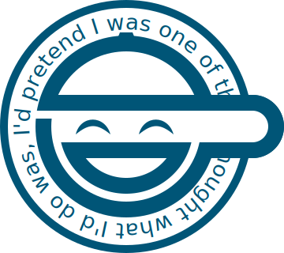

<p align="center">
  
</p>

# laughing-man

[](https://www.npmjs.com/package/@sadcoderlabs/laughing-man)
[](https://github.com/sadcoderlabs/laughing-man/actions/workflows/ci.yml)
[](https://github.com/sadcoderlabs/laughing-man/blob/main/skills/laughing-man/SKILL.md)

Turn your Markdown into a self-hosted newsletter.

Write your newsletter in Markdown with whatever tools you like (Obsidian, Logseq, VSCode, etc.). `laughing-man` turns them into a static archive site and email-ready newsletter HTML. Host on Cloudflare Pages, deliver to subscribers with Resend. Fully self-hosted, fully free within their free tiers. No CMS, no database, no code.

## Installation

Requires Node.js 22+ and a domain name.

```bash
npm install -g @sadcoderlabs/laughing-man
```

Or run without installing:

```bash
npx @sadcoderlabs/laughing-man --help
```

## Usage

If you're the type who skips the manual, just copy this prompt to your agent:

```prompt
How do I use this tool? Read https://raw.githubusercontent.com/sadcoderlabs/laughing-man/main/skills/laughing-man/SKILL.md
```

### Initiate

Generate `laughing-man.yaml` in any folder:

```bash
cd /path/to/your/markdown/folder/
laughing-man init
```

### Preview

Preview your newsletter website (and the email template) with the local server:

```bash
laughing-man preview
```

### Configure

```yaml
name: Your Newsletter Name
description: A newsletter by [Your Name](https://blog.example.com)
issues_dir: .
attachments_dir: .

web_hosting:
  provider: cloudflare-pages
  project: your-newsletter-name
  domain: example.com

email_hosting:
  provider: resend
  from: "Your Name <newsletter@example.com>"
  reply_to: newsletter@example.com

env:
  CLOUDFLARE_API_TOKEN: "cf_xxxxx" # or set CLOUDFLARE_API_TOKEN env var
  RESEND_API_KEY: "re_xxxxx" # or set RESEND_API_KEY env var
```

- Get your Cloudflare API token from [dash.cloudflare.com/profile/api-tokens](https://dash.cloudflare.com/profile/api-tokens)
  - Permissions:
    - `Account | Cloudflare Pages | Edit`
    - `Zone | DNS | Edit`
  - Account Resources
    - `Include | your account name`
  - Zone Resources:
    - `Include | Specific zone | example.com`
- Get your Resend API key from [resend.com/api-keys](https://resend.com/api-keys)
  - Permission: **Full access**
    - Because the subscribe function creates contacts, not just sends email

### Deploy

Set up Cloudflare Pages (project + custom domain + DNS) and deploy:

```bash
laughing-man setup web                 # Create Cloudflare Pages project + custom domain + DNS
laughing-man deploy                    # Deploy to Cloudflare Pages
```

Set up Resend and send an issue:

```bash
laughing-man setup newsletter          # Verify Resend API key + sender domain + DNS
laughing-man send <issue-number>       # Send an issue via Resend Broadcast
```
